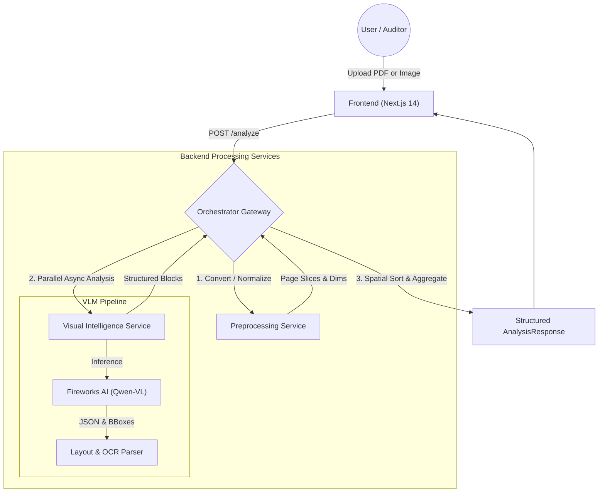

<p align="center">
  <picture>
    <source media="(prefers-color-scheme: dark)" srcset="https://raw.githubusercontent.com/aiexponent/.github/main/brand/logo-full-dark.png">
    <source media="(prefers-color-scheme: light)" srcset="https://raw.githubusercontent.com/aiexponent/.github/main/brand/logo-full-light.png">
    
  </picture>
</p>

# Agentic Document Analyser

> Multi-agent VLM document analysis engine for EU AI Act Article 9 risk management & Annex IV technical documentation.

[](LICENSE)
[](https://artificialintelligenceact.eu/)
[](ARCHITECTURE.md)
[](#privacy--telemetry)
[](https://www.python.org/)

**Agentic Document Analyser** is a high-throughput, agentic document intelligence engine purpose-built to parse, verify, and structure complex, unstructured technical artifacts (multi-page PDFs, architecture diagrams, compliance schemas, charts, and scan records) into audit-ready JSON intelligence. 

Driven by state-of-the-art **Vision-Language Models (VLMs)** such as **Qwen2-VL** and **Qwen2.5-VL** (via Fireworks AI), it performs unified layout classification, visual grounding, and optical character recognition (OCR) in a single unified inference pass.

> **"Visual First, Text Second."** Traditional OCR tools strip away visual layout, flattening columns, headers, tables, flowcharts, and architecture diagrams into unstructured text blobs. Agentic Document Analyser preserves spatial and semantic context—grounding every extracted paragraph, diagram block, and data table with exact pixel coordinates.

---

## ⚖️ EU AI Act Article 9 & Annex IV Alignment

Under the EU AI Act, providers and deployers of high-risk AI systems face stringent technical documentation and risk governance requirements:

* **Article 9 (Risk Management System)**: Mandates continuous identification, estimation, and mitigation of risks throughout the AI lifecycle. Technical evidence often lives in heterogeneous artifacts—system topology diagrams, hazard analyses, data flow charts, and test sign-offs. Agentic Document Analyser extracts and grounds evidence nodes from these visual artifacts to feed directly into **[RiskForge](https://github.com/aiexponent/riskforge)** risk registries.
* **Annex IV (Technical Documentation)**: Requires detailed, structured descriptions of system architecture, data provenance, model evaluation metrics, and validation procedures. Agentic Document Analyser parses multi-page architecture blueprints and regulatory submissions into structured JSON representations that can be cross-referenced against statutory checklists.

---

## 🏗️ System Architecture

The engine is engineered around a **cloud-native, event-driven microservices architecture** orchestrated by an asynchronous workflow gateway.

### High-Level Data Flow



### Microservices Breakdown

| Service | Port | Tech Stack | Responsibilities |
| :--- | :--- | :--- | :--- |
| **Frontend** | `:3001` (Docker) / `:3000` | Next.js 14, React, Tailwind CSS, Shadcn/UI | Modern web interface for drag-and-drop file ingestion, multi-page visualization, and bounding box inspection. |
| **Orchestrator** | `:8000` | FastAPI, Python 3.11, AsyncIO, HTTPX | Central workflow gateway. Handles intake, job coordination, parallel page dispatch, error handling, and response aggregation. |
| **Preprocessing** | `:8001` | FastAPI, Python 3.11, OpenCV, pdf2image | CPU-bound normalization: PDF-to-Image rendering, non-local means denoising, and contour deskewing. |
| **Visual Intelligence** | `:8002` | FastAPI, Python 3.11, Fireworks AI SDK | Unified visual analysis: interfaces with VLMs to detect layout regions, extract diagram text, and normalize bounding boxes. |

---

## 🚀 Key Features

* **Unified Visual-Language Analysis**: Simultaneously performs layout classification, OCR, and semantic understanding without separate OCR pipeline stitching.
* **Multi-Page Concurrency**: Asynchronously processes multi-page PDF documents in parallel via Python `asyncio.gather`.
* **Visual Grounding**: Provides normalized bounding boxes (`x1, y1, x2, y2`) for every detected title, paragraph, header, table, and diagram.
* **Resilient Microservices**: Downstream service isolation with explicit timeouts, retries, and clean error propagation.
* **Audit-Ready Visualizer**: Interactive canvas overlay mapping bounding boxes onto rendered pages with hover tooltips and JSON export.

---

## 🛠️ Quickstart

### Prerequisites

* **Docker** & **Docker Compose** (recommended for production and local evaluation)
* **Python 3.11+** (for manual local execution)
* **Node.js 20+** & `npm` (for frontend development)
* **Poppler** (required for PDF rendering in manual mode):
  * macOS: `brew install poppler`
  * Ubuntu / Debian: `sudo apt-get install -y poppler-utils`
* **Fireworks AI API Key**: Get an API key at [fireworks.ai](https://fireworks.ai/)

---

### Option 1: One-Click Docker Compose (Recommended)

1. **Clone the repository**:
   ```bash
   git clone https://github.com/aiexponent/agentic-document-analyser.git
   cd agentic-document-analyser
   ```

2. **Configure environment**:
   ```bash
   cp .env.cloud.template .env
   # Edit .env and set your FIREWORKS_API_KEY
   ```

3. **Launch the entire stack**:
   ```bash
   docker compose up --build
   ```

4. **Access services**:
   * Frontend UI: [http://localhost:3001](http://localhost:3001)
   * Orchestrator API Docs: [http://localhost:8000/docs](http://localhost:8000/docs)
   * Preprocessing Health: [http://localhost:8001/health](http://localhost:8001/health)
   * Visual Intelligence Health: [http://localhost:8002/health](http://localhost:8002/health)

---

### Option 2: Manual Local Development

1. **Create and activate a Python 3.11 virtual environment**:
   ```bash
   python3.11 -m venv .venv
   source .venv/bin/activate
   pip install --upgrade pip
   ```

2. **Install backend dependencies**:
   ```bash
   pip install -r orchestrator/requirements.txt
   pip install -r preprocessing_service/requirements.txt
   pip install -r visual_service/requirements.txt
   ```

3. **Configure your API key**:
   ```bash
   export FIREWORKS_API_KEY="your_api_key_here"
   ```

4. **Run each backend service** (in separate terminal sessions):
   ```bash
   # Terminal 1: Preprocessing Service
   uvicorn preprocessing_service.main:app --port 8001 --reload

   # Terminal 2: Visual Intelligence Service
   uvicorn visual_service.main:app --port 8002 --reload

   # Terminal 3: Orchestrator Gateway
   uvicorn orchestrator.main:app --port 8000 --reload
   ```

5. **Run the frontend**:
   ```bash
   cd frontend
   npm install
   npm run dev
   # UI available at http://localhost:3000
   ```

---

## 🔒 Privacy & Telemetry

* **Zero Telemetry**: Agentic Document Analyser contains zero tracking, zero product analytics, and zero external telemetry.
* **Data Sovereignty**: Uploaded documents are processed entirely in memory or temporary local scratch space and wiped immediately following analysis completion.
* **Cloud Privacy**: When using external VLMs (Fireworks AI), payloads are transmitted over TLS directly between your visual service container and the inference endpoint under your own API account credentials.

---

## 🔮 Roadmap

* [ ] **Structured Table Cell Extraction**: Full AST table parsing extracting row spans, column spans, and Markdown/HTML representations.
* [ ] **Asynchronous Task Queue**: Celery / Redis queue integration for background processing of 100+ page technical filings.
* [ ] **Local Offline VLM Inference**: Support for local Ollama / vLLM endpoints (Qwen2-VL, LLaVA-NeXT) for air-gapped deployments.
* [ ] **Compliance Evidence Connector**: Direct push integration with [RiskForge](https://github.com/aiexponent/riskforge) Article 9 risk management registries.

---

## 🤝 Community & Governance

We maintain strict open-source governance and quality standards:

* **[Contributing Guide](CONTRIBUTING.md)**: Development setup, coding standards, and PR workflows.
* **[Security Policy](SECURITY.md)**: Coordinated vulnerability disclosure guidelines and SLAs.
* **[Code of Conduct](CODE_OF_CONDUCT.md)**: Contributor Covenant v2.1.
* **[Architecture Guide](ARCHITECTURE.md)**: Detailed component interactions and schema definitions.

---

## 📄 License

Licensed under the **Apache License, Version 2.0**. See [LICENSE](LICENSE) and [NOTICE](NOTICE).

---

*Part of the AiExponent open-source AI governance toolchain:*
[litmusai](https://github.com/aiexponent/litmusai) (Art. 5) · [license-compliance-checker](https://github.com/aiexponent/license-compliance-checker) (Art. 53) · [rag-benchmarking](https://github.com/aiexponent/rag-benchmarking) (Art. 15) · [riskforge](https://github.com/aiexponent/riskforge) (Art. 9) · **agentic-document-analyser** (Art. 9 / Annex IV)
