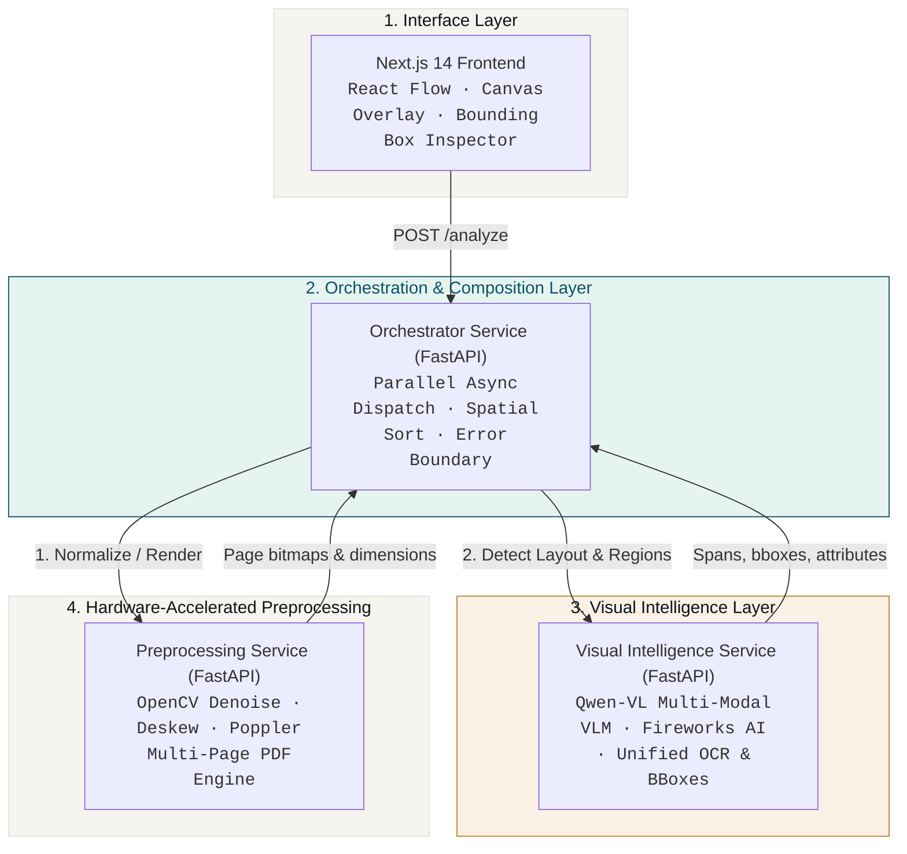
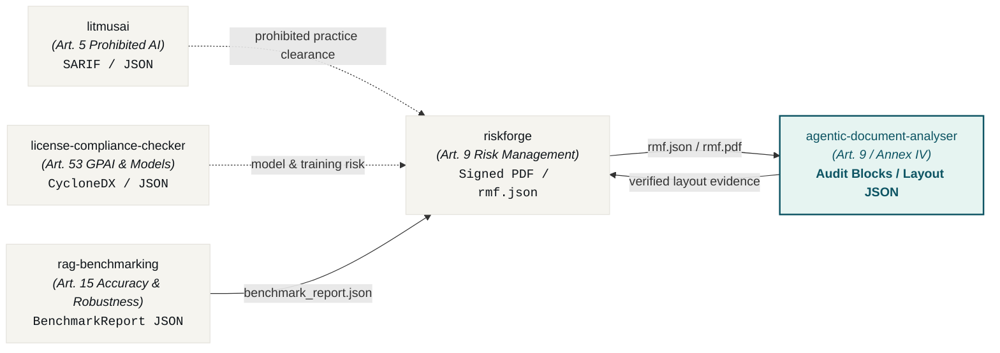
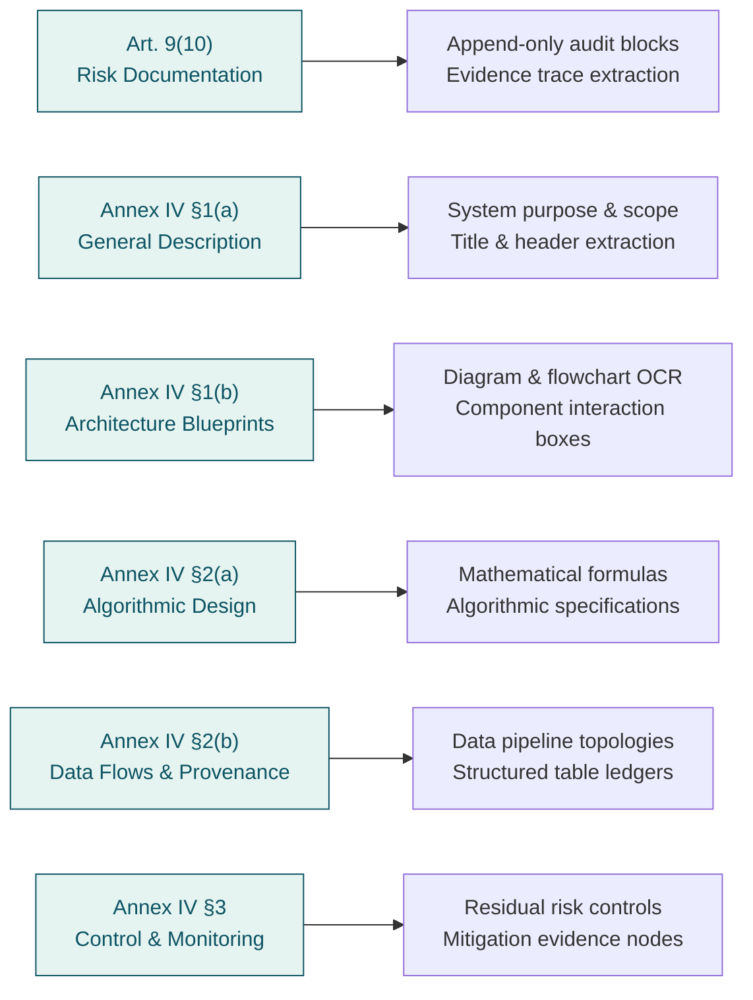

<div align="center">
  <picture>
    <source media="(prefers-color-scheme: dark)" srcset="https://raw.githubusercontent.com/aiexponent/agentic-document-analyser/main/.github/brand/og-agentic-document-analyser-dark.png">
    <source media="(prefers-color-scheme: light)" srcset="https://raw.githubusercontent.com/aiexponent/agentic-document-analyser/main/.github/brand/og-agentic-document-analyser-light.png">
    
  </picture>
  <h1 align="center">Agentic Document Analyser</h1>
  <p align="center"><em>Multi-agent VLM document analysis engine for EU AI Act Article 9 risk management & Annex IV technical documentation.</em></p>
  <p align="center">
    <a href="https://github.com/aiexponent/agentic-document-analyser/actions"></a>
    <a href="LICENSE"></a>
    <a href="https://www.python.org/downloads/"></a>
    <a href="https://eur-lex.europa.eu/legal-content/EN/TXT/?uri=CELEX:32024R1689"></a>
    <a href="#privacy"></a>
    <a href="#evidence-status"></a>
  </p>
</div>

---

> **Agentic Document Analyser extracts, normalizes, and structures evidence from complex multi-modal technical documentation for EU AI Act Article 9 (Risk Management System) and Annex IV (Technical Documentation). Apache 2.0, AS IS.**
>
> Agentic Document Analyser turns unstructured engineering diagrams, complex system architectures, and multi-page technical compliance dossiers into audit-ready, spatially-ordered regulatory evidence. Agentic Document Analyser is an engineering workflow tool that automates evidence extraction and layout intelligence; it is **not** a notified body and does not constitute formal legal certification.

---

## The Problem

Under the EU AI Act ([Regulation (EU) 2024/1689](https://eur-lex.europa.eu/legal-content/EN/TXT/?uri=CELEX:32024R1689)), providers and deployers of **high-risk AI systems** (governed by Article 6 and Annex III) face mandatory statutory obligations under **Article 9 (Risk Management System)** and **Article 11 / Annex IV (Technical Documentation)**:

* **Statutory Requirement**: High-risk AI systems must have exhaustive, up-to-date technical documentation drawn up before placement on the market or putting into service (Annex IV §1–§3), with continuous verification of risk management controls (Article 9(10)).
* **Provisional Enforcement Deadline**: Stand-alone high-risk systems under Annex III must comply by **2 December 2027** (under the Digital Omnibus simplification package).
* **Statutory Non-Compliance Penalties**: Fines up to **€15,000,000 or 3% of total worldwide annual turnover** under Article 99(4).
* **The Visual & Unstructured Documentation Bottleneck**: Real-world AI compliance filings, model cards, hazard analyses, and system designs consist of complex multi-column PDFs, Miro/Figma architecture blueprints, hardware topology diagrams, and structured data tables. Traditional OCR tools strip away visual layout, flattening multi-column text into disordered strings, while completely missing diagrammatic relationships, flowchart arrows, and table boundaries.

**Agentic Document Analyser** resolves the visual compliance extraction challenge directly in your terminal and CI/CD pipeline:

> *"How do we reliably extract, verify, and structure regulatory compliance evidence from visual blueprints, architecture diagrams, and complex PDFs without manual transcription?"*

Agentic Document Analyser provides a decoupled, multi-agent microservice architecture driven by high-throughput Vision-Language Models (VLMs) like Qwen-VL. It simultaneously performs layout classification, visual grounding, and optical character recognition in a single unified inference pass—grounding every extracted block with precise pixel coordinates and deterministic reading order.

Built by [AI Exponent LLC](https://aiexponent.com). Apache 2.0. Runs entirely offline or with sovereign private endpoints.

---

## Quick Start

### 1. One-Click Docker Compose (Recommended)

```bash
# Clone the repository
git clone https://github.com/aiexponent/agentic-document-analyser
cd agentic-document-analyser

# Configure environment variables
cp .env.cloud.template .env
# Edit .env and supply your FIREWORKS_API_KEY

# Spin up all microservices
docker compose up --build
```

Access the running environment:
* **Interactive Visualizer (Frontend)**: [http://localhost:3001](http://localhost:3001) (Docker) or [http://localhost:3000](http://localhost:3000) (Local)
* **Orchestrator Swagger Docs**: [http://localhost:8000/docs](http://localhost:8000/docs)
* **Preprocessing Health**: [http://localhost:8001/health](http://localhost:8001/health)
* **Visual Intelligence Health**: [http://localhost:8002/health](http://localhost:8002/health)

---

### 2. Direct API Ingestion

Submit any architecture diagram or multi-page PDF document to the orchestrator:

```bash
curl -X POST "http://localhost:8000/analyze" \
  -F "file=@examples/architecture_diagram.png" | jq .
```

Example Python client invocation:

```python
import httpx

with open("compliance_dossier.pdf", "rb") as f:
    response = httpx.post(
        "http://localhost:8000/analyze",
        files={"file": ("compliance_dossier.pdf", f, "application/pdf")},
        timeout=60.0,
    )

data = response.json()
print(f"Status: {data['status']}")
print(f"Extracted Pages: {len(data['document']['pages'])}")
print(f"Identified Visual Blocks: {len(data['document']['visual_elements'])}")
```

---

## Why Agentic Document Analyser

| Evaluation / Analysis Method | Cost | Turnaround | Complex Architecture & Diagram Extraction | Offline / Sovereign VLM? | Structured Annex IV JSON? |
| :--- | :--- | :--- | :--- | :--- | :--- |
| **Traditional OCR (Tesseract / Text-only)** | Free | Fast | ❌ No (Cannot parse diagrams/flows) | ✅ Local | ❌ Raw unstructured text |
| **Proprietary Cloud Document APIs** | High per-page fees | Hours | ⚠️ Partial (Tables only, poor diagram context) | ❌ Cloud lock-in / data egress | ❌ Proprietary format |
| **Manual Compliance Review** | €80K–€250K | Weeks | ❌ Inconsistent manual transcription | ❌ NDAs & third-party exposure | ⚠️ Manual formatting |
| **Agentic Document Analyser** | **Free (Apache 2.0)** | **Seconds** | **✅ Yes (Multi-modal VLM layout intelligence)** | **✅ Local microservices / zero telemetry** | **✅ Structured Annex IV JSON** |

---

## System Architecture

Agentic Document Analyser is built on a four-tier decoupled microservices architecture with strict service boundaries:



### Microservices Specification

| Service | Port | Technology Stack | Core Responsibility |
| :--- | :--- | :--- | :--- |
| **`ada-frontend`** | `:3001` (Docker) / `:3000` | Next.js 14, React, Tailwind CSS | High-precision visual inspector with interactive SVG bounding-box overlays, reading-order visualizer, and JSON export. |
| **`ada-orchestrator`** | `:8000` | FastAPI, Python 3.11, HTTPX, AsyncIO | Central workflow gateway. Orchestrates multi-page parallel dispatch, spatial reading-order sorting, and aggregate response construction. |
| **`ada-preprocessing`** | `:8001` | FastAPI, Python 3.11, OpenCV, pdf2image | High-speed image normalization: multi-page PDF rasterization (Poppler), non-local means denoising, and contour deskewing. |
| **`ada-visual`** | `:8002` | FastAPI, Python 3.11, Fireworks AI SDK | Unified Vision-Language Model inference: classifies document layout, extracts text within diagrams, and normalizes bounding boxes. |

---

## AI Exponent Governance Toolchain

Agentic Document Analyser operates as the Technical Documentation (Annex IV) and Visual Evidence cornerstone within the open-source AiExponent governance toolchain:



All interactions occur via plain JSON artifacts on disk and standard REST interfaces.

---

## EU AI Act Article 9 & Annex IV Alignment



Cross-maps directly to:
* **NIST AI RMF 1.0**: `MAP 1.1` (Context description), `MAP 1.5` (System components), `MEASURE 2.1` (Documentation completeness)
* **ISO/IEC 42001:2023**: Clause 8.2 (AI System Impact Assessment), Clause 8.3 (Managing Risks), Annex Controls A.6–A.8

---

## Interactive Artifact Previews

<details>
  <summary><b>📄 View Sample Structured Analysis Response (<code>AnalysisResponse</code> JSON)</b></summary>

```json
{
  "job_id": "7b3a9e14-6c2d-4f81-9b1e-2a5d8f4e3c90",
  "status": "completed",
  "timestamp": "1774390800.0",
  "document": {
    "text": "System Architecture Overview\nData Ingestion -> Validation Gate -> Serving Pipeline\nCompliance evidence verified.",
    "pages": [
      {
        "page_number": 1,
        "dimension": {
          "width": 1280.0,
          "height": 720.0,
          "unit": "pixel"
        },
        "blocks": [
          {
            "block_type": "title",
            "text": "System Architecture Overview",
            "bounding_box": {
              "x1": 50.0,
              "y1": 30.0,
              "x2": 600.0,
              "y2": 70.0
            }
          },
          {
            "block_type": "diagram",
            "text": "Data Ingestion -> Validation Gate -> Serving Pipeline",
            "bounding_box": {
              "x1": 50.0,
              "y1": 100.0,
              "x2": 1200.0,
              "y2": 450.0
            }
          }
        ]
      }
    ],
    "entities": [],
    "visual_elements": [
      {
        "id": "vis_1_0",
        "element_type": "diagram",
        "description": "High-level ML architecture dataflow",
        "bounding_box": {
          "x1": 50.0,
          "y1": 100.0,
          "x2": 1200.0,
          "y2": 450.0
        }
      }
    ],
    "tables": []
  }
}
```
</details>

<details>
  <summary><b>🔍 View Visual Intelligence Region Detection Payload (<code>/detect/layout</code>)</b></summary>

```json
{
  "detections": [
    {
      "label": "title",
      "confidence": 1.0,
      "bbox": { "x1": 40.0, "y1": 25.0, "x2": 580.0, "y2": 65.0 },
      "attributes": { "text": "Annex IV Technical Specification" }
    },
    {
      "label": "diagram",
      "confidence": 1.0,
      "bbox": { "x1": 40.0, "y1": 90.0, "x2": 1150.0, "y2": 520.0 },
      "attributes": { "text": "Model Gateway -> Safety Alignment Gate -> API Output" }
    }
  ]
}
```
</details>

---

## CI/CD Integration & Exit Codes

Add Agentic Document Analyser to your CI/CD pipeline to verify compliance architecture documentation automatically on every pull request:

```yaml
# .github/workflows/document-compliance-gate.yml
name: EU AI Act Documentation Compliance Gate
on: [pull_request, push]

jobs:
  verify-docs:
    runs-on: ubuntu-latest
    steps:
      - uses: actions/checkout@v4
      - name: Set up Python 3.11
        uses: actions/setup-python@v5
        with:
          python-version: "3.11"
      - name: Install System Dependencies
        run: sudo apt-get update && sudo apt-get install -y poppler-utils libgl1
      - name: Run Test Suite
        env:
          ENV: dev
          FIREWORKS_API_KEY: ${{ secrets.FIREWORKS_API_KEY }}
        run: |
          pip install -r requirements-dev.txt
          pytest tests/ -v
```

### Exit Code Contract

| Exit Code | Meaning | CI Behavior |
| :--- | :--- | :--- |
| `0` | **PASS / VALID** | Document parsed successfully; layout coordinates and schemas verified. |
| `1` | **PARSE / OCR FAILURE** | Input document corrupt, VLM inference timeout, or service error. |
| `2` | **TEST / GATE FAILURE** | Pytest test collection failure, syntax error, or unhandled assertion. |
| `128` | **GIT / PERMISSION BLOCK** | Branch protection or protected ref restriction encountered. |

---

## API Endpoint Reference

| Endpoint | Method | Service | Description |
| :--- | :--- | :--- | :--- |
| `/analyze` | `POST` | Orchestrator | Complete pipeline: ingests PDF/Image, normalizes, detects layout via VLM, and returns sorted document JSON. |
| `/health` | `GET` | Orchestrator | Verifies orchestrator health and connectivity. |
| `/preprocess/normalize` | `POST` | Preprocessing | Applies OpenCV non-local means denoising and contour deskewing to a single image. |
| `/preprocess/pdf_to_images` | `POST` | Preprocessing | Converts a multi-page PDF into an array of base64-encoded PNG images via Poppler. |
| `/health` | `GET` | Preprocessing | Verifies preprocessing worker status. |
| `/detect/layout` | `POST` | Visual Intelligence | Runs Qwen-VL unified layout detection, OCR, and coordinate denormalization. |
| `/health` | `GET` | Visual Intelligence | Verifies visual intelligence worker and fireworks model configuration. |

---

## Features

| Feature | Detail |
|---|---|
| **Multi-Modal VLM Intelligence** | Direct visual reasoning via Qwen-VL, extracting text inside diagrams, flowcharts, and complex layouts without fragile multi-stage OCR pipelines |
| **Deterministic Reading-Order Sort** | Spatially bucketed 2D coordinate sorting ensuring extracted paragraphs and headers maintain logical reading flow |
| **Hardware-Accelerated Normalization** | OpenCV-powered image deskewing and denoising to maximize OCR character recognition accuracy |
| **Multi-Page Asynchronous Concurrency** | Non-blocking page-by-page dispatch via Python `asyncio.gather` for rapid document turnaround |
| **Zero Telemetry & Local Execution** | Completely self-contained execution with zero tracking, telemetry, or external data retention |
| **Enterprise Containerization** | Production-ready `docker-compose.yml` with health checks, network isolation, and standardized `ada-*` naming |

---

## Contributing

We welcome community contributions! Please review [CONTRIBUTING.md](CONTRIBUTING.md) for code style guidelines and testing conventions.

```bash
git clone https://github.com/aiexponent/agentic-document-analyser
cd agentic-document-analyser

# Create development environment
python3.11 -m venv .venv
source .venv/bin/activate
pip install -r requirements-dev.txt

# Run full test suite (29 tests)
pytest tests/ -v

# Run Ruff linter
ruff check .
```

---

## Documentation

- [System Architecture](ARCHITECTURE.md) — Detailed microservices architecture, data contracts, and schema designs.
- [Contributing Guide](CONTRIBUTING.md) — Development setup, test standards, and PR workflows.
- [Security Policy](SECURITY.md) — Vulnerability disclosure process and 48-hour response SLA.
- [Code of Conduct](CODE_OF_CONDUCT.md) — Contributor Covenant v2.1 standards.

---

## Important Disclaimers

<a name="evidence-status"></a>

### Technical Documentation & Legal Status

> **REGULATORY EVIDENCE EXTRACTOR — NOT A NOTIFIED BODY**
>
> Agentic Document Analyser extracts, normalizes, and structures evidence from technical documents and diagrams to satisfy EU AI Act Article 9 and Annex IV requirements. It is a technical workflow utility authored to support engineering and governance teams.
>
> **Agentic Document Analyser does not constitute legal advice and is not a notified body.** Using this software does not replace mandatory third-party conformity assessment where required under Article 43 of the EU AI Act.

---

## Privacy & Zero-Telemetry Guarantee

<a name="privacy"></a>

Agentic Document Analyser makes **zero outbound tracking or analytics connections**. Document uploads are processed transiently in memory or temporary scratch directories and discarded immediately following analysis.

```
Agentic Document Analyser v1.0.0 | Apache 2.0 | Zero telemetry | aiexponent.com
```

---

## Releases

| Version | Highlights |
|---|---|
| **[v1.0.0](https://github.com/aiexponent/agentic-document-analyser/releases/tag/v1.0.0)** | Enterprise parity release: Brand overhaul (EU AI Act Article 9 & Annex IV scope), dual-mode hero banners, automated 29-test pytest suite, Ruff linting, Bandit/pip-audit/npm security CI workflows, Dependabot, and sanitized Docker Compose. |
| [v0.1.0](https://github.com/aiexponent/agentic-document-analyser/releases/tag/v0.1.0) | Initial proof of concept: Multi-modal VLM layout detection, OpenCV deskewing/denoising, and Next.js visualizer. |

---

## License

[Apache 2.0](LICENSE), free to use, modify, and distribute.

Built by [AI Exponent LLC](https://aiexponent.com), `hello@aiexponent.com`

---

*Part of the AiExponent open-source AI governance toolchain:*  
[litmusai](https://github.com/aiexponent/litmusai) (Art. 5) · 
[license-compliance-checker](https://github.com/aiexponent/license-compliance-checker) (Art. 53) · 
[rag-benchmarking](https://github.com/aiexponent/rag-benchmarking) (Art. 15) · 
[riskforge](https://github.com/aiexponent/riskforge) (Art. 9) · 
**agentic-document-analyser** (Art. 9 / Annex IV)

---

<div align="center">
  <sub>
    <a href="https://aiexponent.com">aiexponent.com</a> ·
    <a href="mailto:hello@aiexponent.com">hello@aiexponent.com</a> ·
    Built in the open · Apache 2.0
  </sub>
</div>
